# CodePing 桌宠产品技术报告

## 一、产品概述

### 1.1 产品定位

CodePing 是一款面向 AI 编程助手的**桌面状态可视化工具**。它以可爱的桌宠形态，实时展示 Claude Code、Comate 等 AI Agent 的工作状态，让开发者直观感知 AI 的思考、执行、等待确认等过程。

### 1.2 核心价值

| 痛点 | 解决方案 |
|------|----------|
| AI 在后台执行，不知道进度 | 桌宠动画实时反映状态 |
| 权限确认容易错过 | 醒目的气泡弹窗提醒 |
| 多任务并发难以追踪 | 不同动画区分并发数量 |
| 长时间无响应不确定是否卡住 | 状态变化即时可见 |

### 1.3 支持的 Agent

- **Claude Code** - Anthropic 官方 AI 编程助手
- **Comate** - 百度智能编程助手

---

## 二、产品架构

### 2.1 模块划分

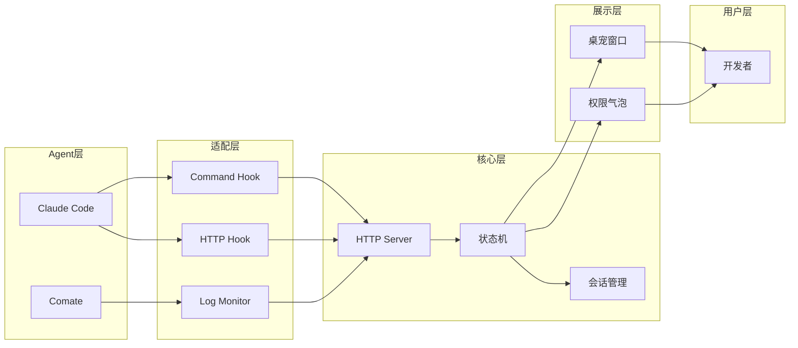

### 2.2 模块职责

| 模块 | 职责 | 核心文件 |
|------|------|----------|
| **Command Hook** | 接收 Agent 命令行事件 | `hooks/clawd-hook.js` |
| **HTTP Hook** | 处理权限请求，支持阻塞等待 | `src/server.js` |
| **Log Monitor** | 轮询解析 Agent 日志文件 | `hooks/comate-monitor.js` |
| **HTTP Server** | 统一事件入口 (端口 23333) | `src/server.js` |
| **状态机** | 状态优先级、最小显示时长 | `src/state.js` |
| **会话管理** | 多会话并发、超时清理 | `src/state.js` |
| **桌宠窗口** | 透明窗口、动画渲染、眼球追踪 | `src/main.js`, `src/renderer.js` |
| **权限气泡** | 工具确认、用户决策回调 | `src/permission.js` |

---

## 三、桌宠展示实现

### 3.1 透明窗口技术

桌宠需要在桌面上"悬浮"显示，核心是创建一个**无边框透明窗口**：

```javascript
// src/main.js - 创建桌宠窗口
const win = new BrowserWindow({
  frame: false,        // 无边框
  transparent: true,   // 背景透明
  alwaysOnTop: true,   // 置顶显示
  skipTaskbar: true,   // 不在任务栏显示
  hasShadow: false,    // 无阴影
});

// 关键：窗口不抢占焦点，不影响用户操作
win.setFocusable(false);
win.setIgnoreMouseEvents(true);  // 点击穿透
```

### 3.2 双窗口架构

为解决"透明窗口无法接收鼠标事件"的问题，采用**渲染/输入分离**的双窗口设计：

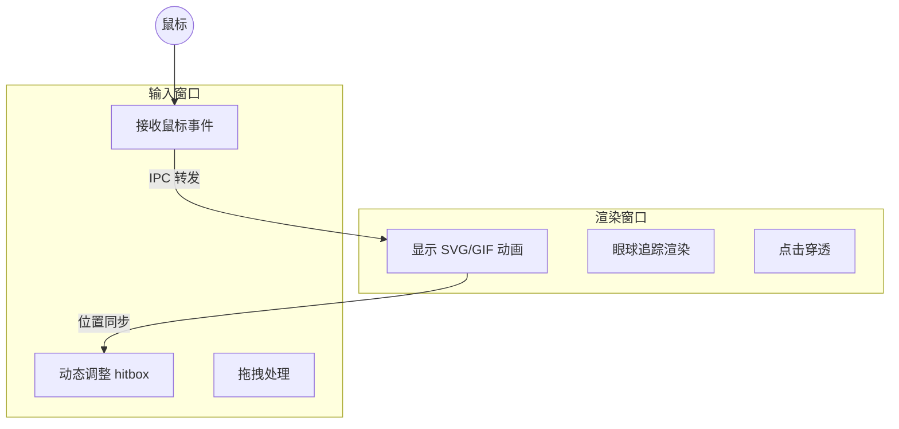

**工作原理**：
- 渲染窗口负责动画显示，设置 `setIgnoreMouseEvents(true)` 实现点击穿透
- 输入窗口完全透明，只负责接收鼠标事件
- 两个窗口位置同步，输入窗口的 hitbox 根据当前动画动态调整

### 3.3 动画状态映射

桌宠通过不同动画反映 Agent 状态：

| Agent 状态 | 桌宠表现 | 动画文件 |
|------------|----------|----------|
| 空闲 | 眼睛跟随鼠标 | `lucy-idle-follow.svg` |
| 思考中 | 打字动画 | `lucy-working-typing.svg` |
| 工作中 (1个任务) | 打字动画 | `lucy-working-typing.svg` |
| 工作中 (2个任务) | 抛球动画 | `lucy-working-juggling.svg` |
| 工作中 (3+任务) | 搭积木动画 | `lucy-working-building.svg` |
| 出错 | 惊讶表情 | `lucy-error-plain.svg` |
| 完成 | 开心跳跃 | `lucy-click-happy.apng` |
| 等待确认 | 举手提醒 | `lucy-notification.svg` |
| 睡眠 | 趴着睡觉 | `lucy-sleeping.svg` |

### 3.4 眼球追踪

空闲状态下，桌宠的眼睛会跟随鼠标移动，增强"活"的感觉：

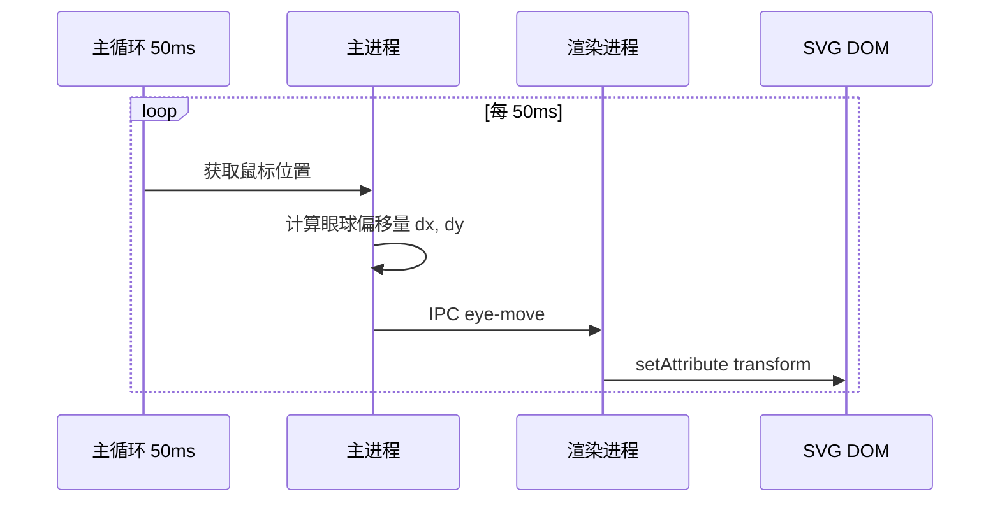

```javascript
// src/renderer.js - 眼球移动
function applyEyeMove(dx, dy) {
  // 眼睛位移
  eyesEl.setAttribute("transform", `translate(${dx}, ${dy})`);
  // 身体微微跟随
  bodyEl.setAttribute("transform", `translate(${dx * 0.3}, 0)`);
}
```

---

## 四、Agent 接入方式

CodePing 支持三种接入方式，适配不同 Agent 的技术架构：

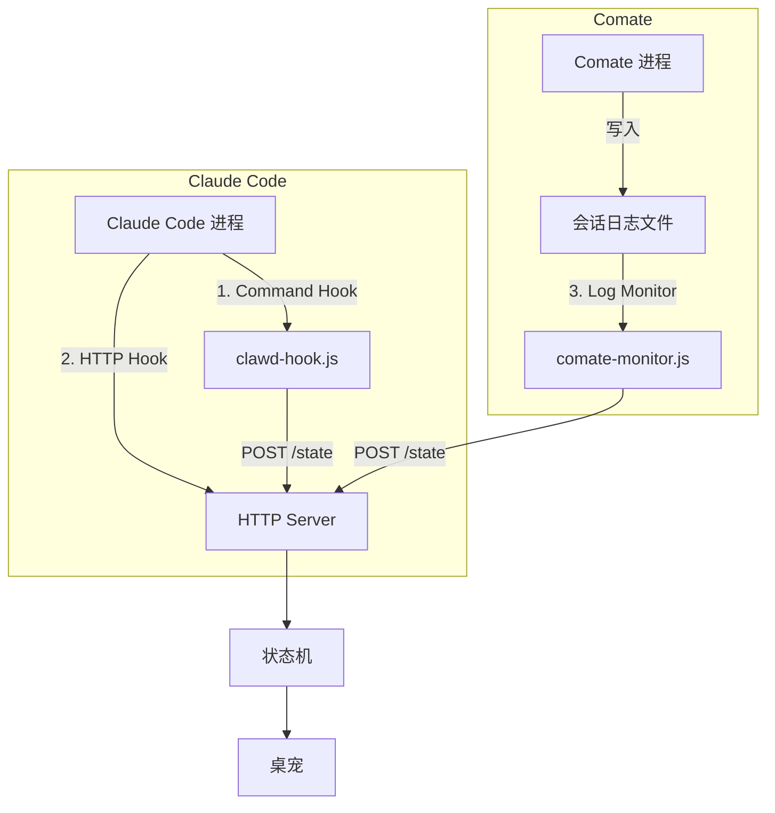

### 4.1 方式一：Command Hook

**适用场景**：Agent 支持命令行 Hook，事件触发时执行脚本

**以 Claude Code 的 `UserPromptSubmit` 事件为例**：

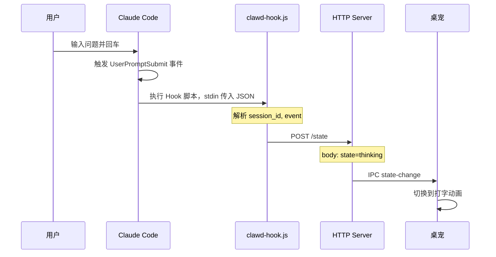

**Hook 脚本核心逻辑** (`hooks/clawd-hook.js`)：

```javascript
// 1. 从 stdin 读取 Claude Code 传入的事件数据
let input = "";
process.stdin.on("data", chunk => input += chunk);
process.stdin.on("end", () => {
  const payload = JSON.parse(input);
  
  // 2. 事件映射为桌宠状态
  const EVENT_TO_STATE = {
    UserPromptSubmit: "thinking",
    PreToolUse: "working",
    PostToolUseFailure: "error",
    Stop: "attention",
  };
  
  const state = EVENT_TO_STATE[payload.event];
  
  // 3. POST 到桌宠服务器
  http.request({
    hostname: "127.0.0.1",
    port: 23333,
    path: "/state",
    method: "POST",
  }).end(JSON.stringify({
    state,
    session_id: payload.session_id,
    event: payload.event,
    agent_id: "claude-code"
  }));
});
```

**Hook 注册配置** (`~/.claude/settings.json`)：

```json
{
  "hooks": {
    "UserPromptSubmit": [{
      "type": "command",
      "command": "node /path/to/clawd-hook.js"
    }],
    "PreToolUse": [{
      "type": "command", 
      "command": "node /path/to/clawd-hook.js"
    }]
  }
}
```

### 4.2 方式二：HTTP Hook

**适用场景**：需要阻塞等待用户确认的场景（如权限请求）

**以 Claude Code 执行危险命令需要确认为例**：

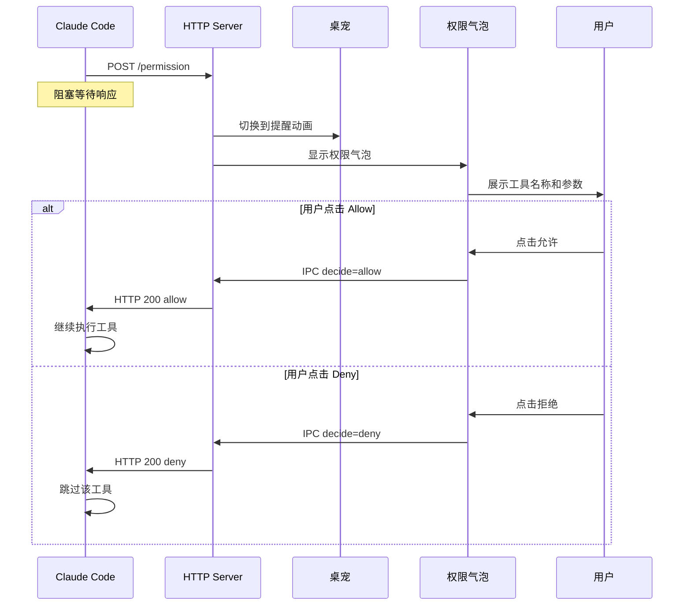

**HTTP Hook 配置**：

```json
{
  "hooks": {
    "PermissionRequest": [{
      "type": "http",
      "url": "http://127.0.0.1:23333/permission",
      "timeout": 600
    }]
  }
}
```

**服务端处理** (`src/server.js`)：

```javascript
// 权限请求处理 - 不立即响应，等待用户决策
if (req.url === "/permission") {
  const data = JSON.parse(body);
  
  // 创建 Promise，保存 resolve 函数
  const entry = {
    toolName: data.tool_name,
    sessionId: data.session_id,
    resolve: null,  // 用户决策后调用
  };
  
  // 显示权限气泡
  showPermissionBubble(entry);
  
  // 返回 Promise，阻塞直到用户决策
  const decision = await new Promise(r => entry.resolve = r);
  
  res.writeHead(200);
  res.end(JSON.stringify({ behavior: decision }));
}
```

### 4.3 方式三：Log Monitor

**适用场景**：Agent 不支持 Hook，但会写入日志文件

**以 Comate 执行工具为例**：

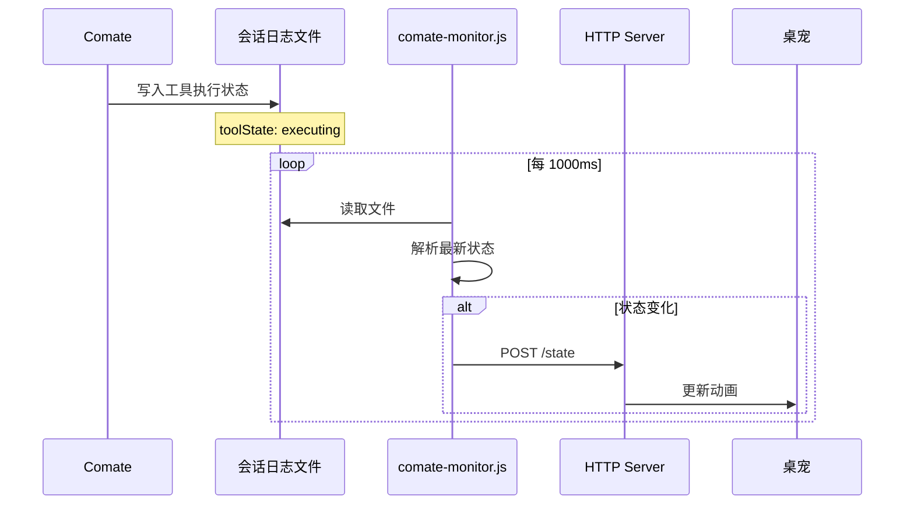

**日志文件结构** (`~/.comate-engine/store/chat_session_*.json`)：

```json
{
  "sessionUuid": "abc-123",
  "messages": [{
    "role": "assistant",
    "status": "inProgress",
    "elements": [{
      "children": [{
        "type": "TOOL",
        "toolName": "Bash",
        "toolState": "executing",
        "params": { "command": "npm install" }
      }]
    }]
  }]
}
```

**Monitor 解析逻辑** (`hooks/comate-monitor.js`)：

```javascript
// 状态推断优先级
function inferState(session) {
  const lastMsg = session.messages.at(-1);
  const tools = extractTools(lastMsg);
  
  // 1. 有待确认的权限请求 → notification
  if (tools.some(t => t.toolState === "executing" && t.metadata?.state === "pending")) {
    return "notification";
  }
  
  // 2. 有失败的工具 → error
  if (tools.some(t => t.toolState === "failed")) {
    return "error";
  }
  
  // 3. 有执行中的工具 → working
  if (tools.some(t => t.toolState === "executing")) {
    return "working";
  }
  
  // 4. 助手正在生成 → thinking
  if (lastMsg.status === "inProgress" && tools.length === 0) {
    return "thinking";
  }
  
  // 5. 完成 → attention
  if (lastMsg.status === "success") {
    return "attention";
  }
  
  return "idle";
}
```

### 4.4 三种方式对比

| 特性 | Command Hook | HTTP Hook | Log Monitor |
|------|--------------|-----------|-------------|
| 触发时机 | 事件触发时 | 需要确认时 | 轮询检测 |
| 响应延迟 | 即时 | 即时 | ~500ms |
| 是否阻塞 | 否 | 是 | 否 |
| 适用场景 | 状态通知 | 权限确认 | Agent 无 Hook |
| Claude Code | ✅ | ✅ | - |
| Comate | - | - | ✅ |

---

## 五、Hook 机制深度解析

本章详细介绍 Command Hook 和 HTTP Hook 的完整工作流程，重点说明权限确认场景下的数据流转。

### 5.1 Hook 机制概述

Claude Code 支持两种 Hook 类型，分别适用于不同场景：

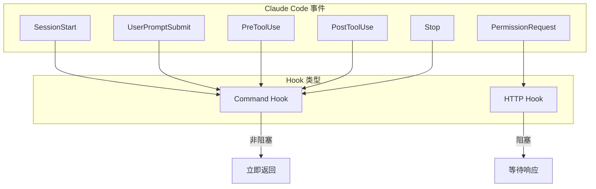

| Hook 类型 | 触发方式 | 是否阻塞 | 典型场景 |
|-----------|----------|----------|----------|
| Command Hook | 执行命令行脚本 | 否 | 状态通知、日志记录 |
| HTTP Hook | 发送 HTTP 请求 | 是 | 权限确认、用户交互 |

### 5.2 Command Hook 完整流程

#### 5.2.1 数据流概览

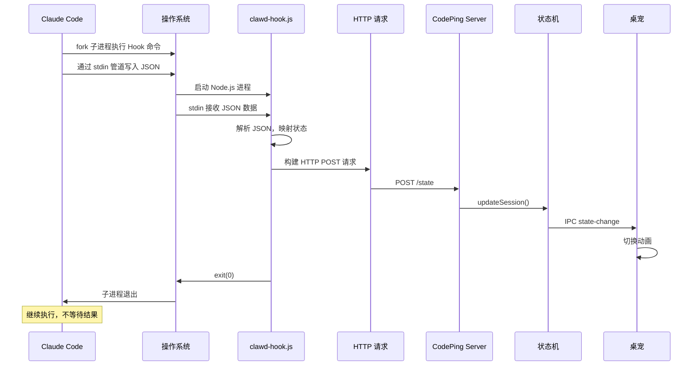

#### 5.2.2 stdin 数据格式

Claude Code 通过 stdin 向 Hook 脚本传递事件数据：

```json
{
  "event": "PreToolUse",
  "session_id": "session_abc123",
  "cwd": "/Users/dev/my-project",
  "tool_name": "Bash",
  "tool_input": {
    "command": "npm install lodash"
  },
  "transcript_path": "/Users/dev/.claude/sessions/abc123.json"
}
```

**字段说明**：

| 字段 | 类型 | 说明 |
|------|------|------|
| `event` | string | 事件类型，如 PreToolUse, Stop |
| `session_id` | string | 会话唯一标识 |
| `cwd` | string | 当前工作目录 |
| `tool_name` | string | 工具名称（仅工具事件） |
| `tool_input` | object | 工具参数（仅工具事件） |
| `transcript_path` | string | 会话记录文件路径 |

#### 5.2.3 Hook 脚本处理流程

```javascript
// hooks/clawd-hook.js - 完整流程

const http = require("http");

// ========== 第一步：读取 stdin ==========
let inputBuffer = "";

process.stdin.setEncoding("utf8");
process.stdin.on("data", (chunk) => {
  inputBuffer += chunk;
});

process.stdin.on("end", () => {
  processEvent(inputBuffer);
});

// ========== 第二步：解析事件并映射状态 ==========
function processEvent(input) {
  let payload;
  try {
    payload = JSON.parse(input);
  } catch (e) {
    process.exit(1);  // JSON 解析失败，静默退出
  }
  
  // 事件到状态的映射表
  const EVENT_TO_STATE = {
    SessionStart: "idle",
    SessionEnd: "sleeping",
    UserPromptSubmit: "thinking",
    PreToolUse: "working",
    PostToolUse: "working",
    PostToolUseFailure: "error",
    Stop: "attention",
    SubagentStart: "juggling",
    SubagentStop: "working",
  };
  
  const state = EVENT_TO_STATE[payload.event];
  if (!state) {
    process.exit(0);  // 未知事件，忽略
  }
  
  // ========== 第三步：构建请求体 ==========
  const body = JSON.stringify({
    state: state,
    session_id: payload.session_id,
    event: payload.event,
    agent_id: "claude-code",
    cwd: payload.cwd || "",
  });
  
  // ========== 第四步：发送 HTTP 请求 ==========
  const req = http.request({
    hostname: "127.0.0.1",
    port: 23333,
    path: "/state",
    method: "POST",
    headers: {
      "Content-Type": "application/json",
      "Content-Length": Buffer.byteLength(body),
    },
    timeout: 500,  // 500ms 超时，避免阻塞 Claude Code
  });
  
  req.on("error", () => {});  // 忽略错误，不影响 Claude Code
  req.write(body);
  req.end();
  
  // 不等待响应，立即退出
  process.exit(0);
}
```

#### 5.2.4 服务端状态更新

```javascript
// src/server.js - /state 端点处理

function handleStateRequest(req, res, body) {
  const data = JSON.parse(body);
  
  // 提取关键字段
  const { state, session_id, event, agent_id, cwd } = data;
  
  // 更新会话状态
  ctx.updateSession(session_id, state, event, {
    agentId: agent_id,
    cwd: cwd,
  });
  
  // 立即返回，不阻塞
  res.writeHead(200);
  res.end("ok");
}

// src/state.js - 状态机处理

function updateSession(sessionId, state, event, opts) {
  // 1. 查找或创建会话
  let session = sessions.get(sessionId);
  if (!session) {
    session = { state: "idle", createdAt: Date.now() };
    sessions.set(sessionId, session);
  }
  
  // 2. 更新会话状态
  session.state = state;
  session.lastActiveAt = Date.now();
  
  // 3. 计算显示状态（考虑多会话优先级）
  const displayState = resolveDisplayState();
  
  // 4. 应用状态变更
  applyState(displayState);
}

function applyState(state) {
  // 通知渲染进程切换动画
  ctx.sendToRenderer("state-change", state, getSvgForState(state));
}
```

### 5.3 HTTP Hook 完整流程

#### 5.3.1 权限确认场景概述

当 Claude Code 需要执行敏感操作（如写入文件、执行命令）时，会触发 `PermissionRequest` 事件。与 Command Hook 不同，HTTP Hook 会**阻塞等待用户确认**后才继续执行。

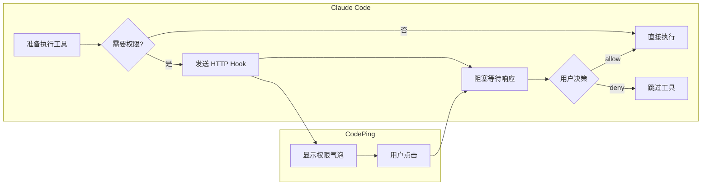

#### 5.3.2 HTTP Hook 请求格式

Claude Code 发送的权限请求：

```http
POST /permission HTTP/1.1
Host: 127.0.0.1:23333
Content-Type: application/json

{
  "tool_name": "Bash",
  "tool_input": {
    "command": "rm -rf node_modules && npm install"
  },
  "session_id": "session_abc123",
  "permission_suggestions": [
    {
      "type": "addRules",
      "toolName": "Bash",
      "ruleContent": "npm *",
      "destination": "localSettings",
      "behavior": "allow"
    }
  ]
}
```

**字段说明**：

| 字段 | 说明 |
|------|------|
| `tool_name` | 请求执行的工具名称 |
| `tool_input` | 工具的参数 |
| `session_id` | 会话标识 |
| `permission_suggestions` | Claude 建议的权限规则 |

#### 5.3.3 完整交互时序

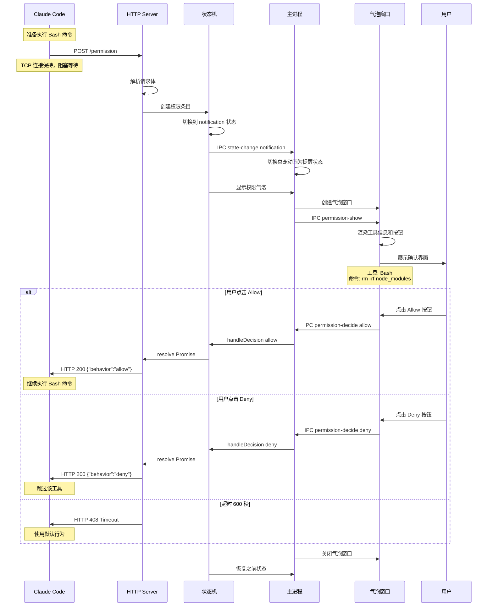

#### 5.3.4 服务端权限处理代码

```javascript
// src/server.js - /permission 端点完整实现

async function handlePermissionRequest(req, res, body) {
  const data = JSON.parse(body);
  
  // ========== 1. 解析请求 ==========
  const {
    tool_name: toolName,
    tool_input: toolInput,
    session_id: sessionId,
    permission_suggestions: suggestions = [],
  } = data;
  
  // ========== 2. 创建权限条目 ==========
  const permEntry = {
    id: generateId(),
    toolName,
    toolInput,
    sessionId,
    suggestions,
    createdAt: Date.now(),
    res,              // 保存响应对象
    resolve: null,    // Promise resolve 函数
  };
  
  // ========== 3. 切换桌宠状态 ==========
  ctx.setState("notification");
  
  // ========== 4. 显示权限气泡 ==========
  ctx.pendingPermissions.push(permEntry);
  ctx.showPermissionBubble(permEntry);
  
  // ========== 5. 阻塞等待用户决策 ==========
  const decision = await new Promise((resolve) => {
    permEntry.resolve = resolve;
    
    // 设置超时
    permEntry.timeoutId = setTimeout(() => {
      resolve({ behavior: "timeout" });
    }, 600 * 1000);  // 600 秒超时
  });
  
  // ========== 6. 返回响应给 Claude Code ==========
  clearTimeout(permEntry.timeoutId);
  
  res.writeHead(200, { "Content-Type": "application/json" });
  res.end(JSON.stringify(decision));
  
  // ========== 7. 恢复桌宠状态 ==========
  ctx.pendingPermissions.shift();
  if (ctx.pendingPermissions.length > 0) {
    // 还有待处理的权限请求
    ctx.showPermissionBubble(ctx.pendingPermissions[0]);
  } else {
    // 恢复到之前的状态
    ctx.applyResolvedDisplayState();
  }
}
```

#### 5.3.5 气泡窗口处理代码

```javascript
// src/permission.js - 显示权限气泡

function showPermissionBubble(entry) {
  if (!bubbleWin) {
    // 创建气泡窗口
    bubbleWin = new BrowserWindow({
      width: 400,
      height: 200,
      frame: false,
      transparent: true,
      alwaysOnTop: true,
      webPreferences: {
        preload: path.join(__dirname, "preload-bubble.js"),
      },
    });
    bubbleWin.loadFile("bubble.html");
  }
  
  // 发送权限信息到气泡窗口
  bubbleWin.webContents.send("permission-show", {
    toolName: entry.toolName,
    toolInput: entry.toolInput,
    suggestions: entry.suggestions,
  });
  
  // 定位到桌宠旁边
  positionBubbleNearPet();
  bubbleWin.show();
}

// src/preload-bubble.js - 气泡窗口 IPC 桥接

contextBridge.exposeInMainWorld("bubbleAPI", {
  // 接收权限显示请求
  onPermissionShow: (cb) => {
    ipcRenderer.on("permission-show", (_, data) => cb(data));
  },
  // 发送用户决策
  decide: (behavior) => {
    ipcRenderer.send("permission-decide", behavior);
  },
});

// src/bubble.html - 气泡窗口 UI

window.bubbleAPI.onPermissionShow((data) => {
  // 显示工具信息
  document.getElementById("tool-name").textContent = data.toolName;
  document.getElementById("tool-params").textContent = 
    JSON.stringify(data.toolInput, null, 2);
  
  // 绑定按钮事件
  document.getElementById("btn-allow").onclick = () => {
    window.bubbleAPI.decide({ behavior: "allow" });
  };
  
  document.getElementById("btn-deny").onclick = () => {
    window.bubbleAPI.decide({ behavior: "deny" });
  };
});
```

#### 5.3.6 用户决策回调

```javascript
// src/main.js - 处理用户决策

ipcMain.on("permission-decide", (_, decision) => {
  const entry = ctx.pendingPermissions[0];
  if (!entry) return;
  
  // 隐藏气泡
  if (bubbleWin) {
    bubbleWin.hide();
  }
  
  // 调用 resolve，解除服务端的 await 阻塞
  entry.resolve(decision);
  
  // 日志记录
  console.log(`Permission ${decision.behavior}: ${entry.toolName}`);
});
```

#### 5.3.7 结果回传机制详解

HTTP Hook 的结果回传是整个权限确认流程的核心，采用**HTTP 长连接延迟响应**模式：

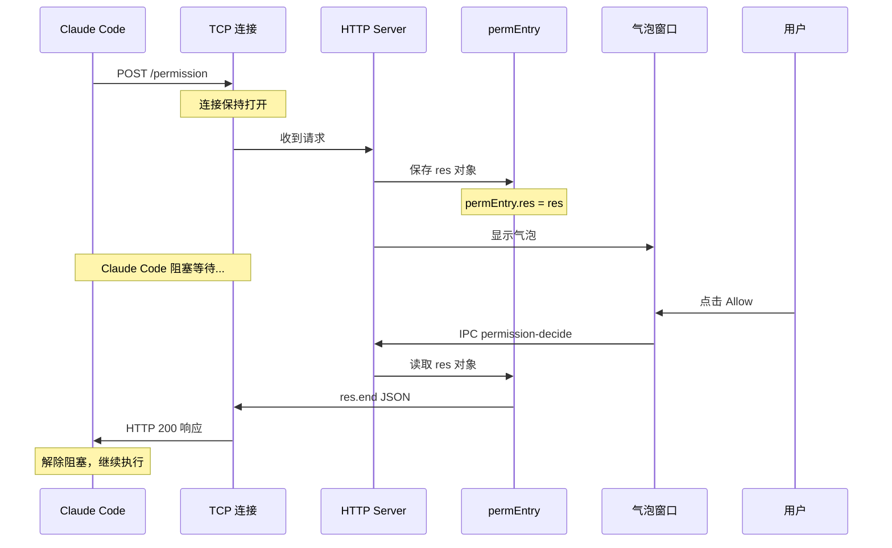

**核心原理**：

| 步骤 | 说明 |
|------|------|
| 1. 保存响应对象 | 收到请求时，将 `res` 对象保存到 `permEntry` 中，**不调用 `res.end()`** |
| 2. 连接保持 | TCP 连接保持打开，Claude Code 处于阻塞等待状态 |
| 3. 用户决策 | 用户点击气泡按钮，通过 IPC 通知主进程 |
| 4. 发送响应 | 通过保存的 `res` 对象调用 `res.end()`，响应发送给 Claude Code |
| 5. 解除阻塞 | Claude Code 收到响应，根据 `behavior` 决定是否执行工具 |

**步骤一：保存响应对象**

```javascript
// src/server.js - 收到权限请求时
const permEntry = {
  toolName,
  sessionId,
  res,  // ⭐ 关键：保存 HTTP 响应对象，不立即响应
  suggestions,
  createdAt: Date.now(),
};
ctx.pendingPermissions.push(permEntry);
ctx.showPermissionBubble(permEntry);
// 注意：此处没有调用 res.end()，连接保持打开
```

**步骤二：处理用户决策**

```javascript
// src/permission.js - 处理用户点击
function handleDecide(event, behavior) {
  const senderWin = BrowserWindow.fromWebContents(event.sender);
  const perm = pendingPermissions.find(p => p.bubble === senderWin);
  
  if (behavior === "allow" || behavior === "deny") {
    resolvePermissionEntry(perm, behavior);
  }
}
```

**步骤三：发送 HTTP 响应**

```javascript
// src/permission.js - 最终发送响应给 Claude Code
function sendPermissionResponse(res, decision) {
  // 检查连接是否还有效
  if (!res || res.writableEnded || res.destroyed) return;
  
  const responseBody = JSON.stringify({
    hookSpecificOutput: {
      hookEventName: "PermissionRequest",
      decision: decision  // { behavior: "allow" } 或 { behavior: "deny" }
    },
  });
  
  res.writeHead(200, { "Content-Type": "application/json" });
  res.end(responseBody);  // ⭐ 此时 Claude Code 收到响应，解除阻塞
}
```

**实际响应报文**：

```http
HTTP/1.1 200 OK
Content-Type: application/json

{
  "hookSpecificOutput": {
    "hookEventName": "PermissionRequest",
    "decision": {
      "behavior": "allow"
    }
  }
}
```

**为什么这种方式可行？**

1. **HTTP 协议支持**：HTTP/1.1 支持持久连接，服务端可以延迟响应
2. **超时控制**：Claude Code 设置了 600 秒超时，足够用户做出决策
3. **连接有效性检查**：发送前检查 `res.destroyed`，处理用户关闭终端的情况
4. **优雅降级**：如果连接断开，Claude Code 会回退到终端内置的权限提示

### 5.5 HTTP Hook 响应格式

CodePing 返回给 Claude Code 的响应：

**允许执行**：
```json
{
  "behavior": "allow"
}
```

**拒绝执行**：
```json
{
  "behavior": "deny"
}
```

**超时**：
```http
HTTP/1.1 408 Request Timeout
```

Claude Code 根据响应决定后续行为：
- `allow`：执行工具
- `deny`：跳过工具，继续对话
- 超时/错误：使用默认行为（通常是拒绝）

### 5.6 两种 Hook 的关键区别

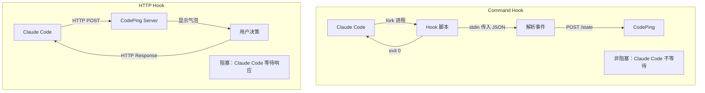

| 维度 | Command Hook | HTTP Hook |
|------|--------------|-----------|
| 数据传递 | stdin → stdout | HTTP Request/Response |
| 进程模型 | fork 子进程 | TCP 长连接 |
| 是否阻塞 | 否，fire-and-forget | 是，等待响应 |
| 超时处理 | 无 | 600 秒超时 |
| 错误处理 | 静默失败 | 返回错误码 |
| 适用场景 | 状态通知 | 需要用户确认 |

---

## 六、状态管理

### 6.1 状态优先级

当多个事件同时发生时，按优先级显示：

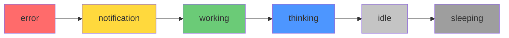

```javascript
const STATE_PRIORITY = {
  error: 8,        // 最高 - 出错必须看到
  notification: 7, // 权限请求需要响应
  working: 3,      // 工作中
  thinking: 2,     // 思考中
  idle: 1,         // 空闲
  sleeping: 0      // 最低 - 睡眠
};
```

### 6.2 多会话并发

CodePing 支持同时追踪多个 Agent 会话：

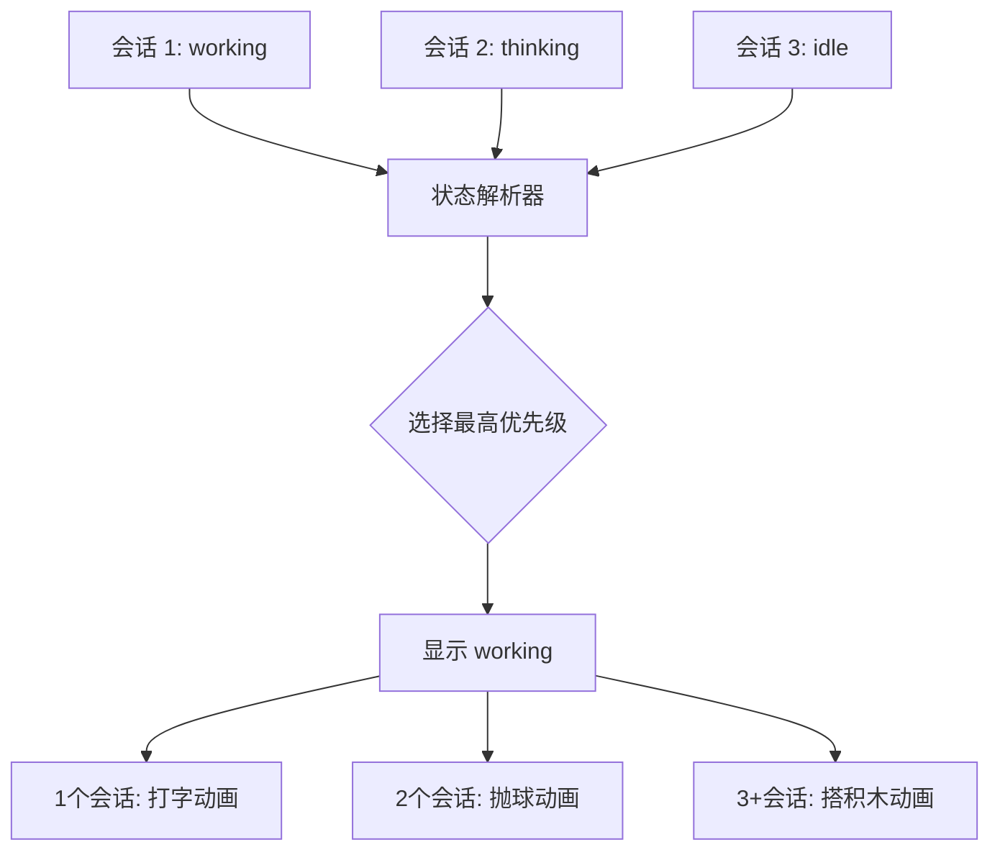

### 6.3 最小显示时长

避免状态快速切换导致动画闪烁：

```javascript
const MIN_DISPLAY_MS = {
  attention: 800,    // 完成状态至少显示 800ms
  notification: 500, // 权限提醒至少 500ms
  error: 600         // 错误状态至少 600ms
};
```

---

## 七、完整交互示例

### 7.1 Claude Code 执行一次完整任务

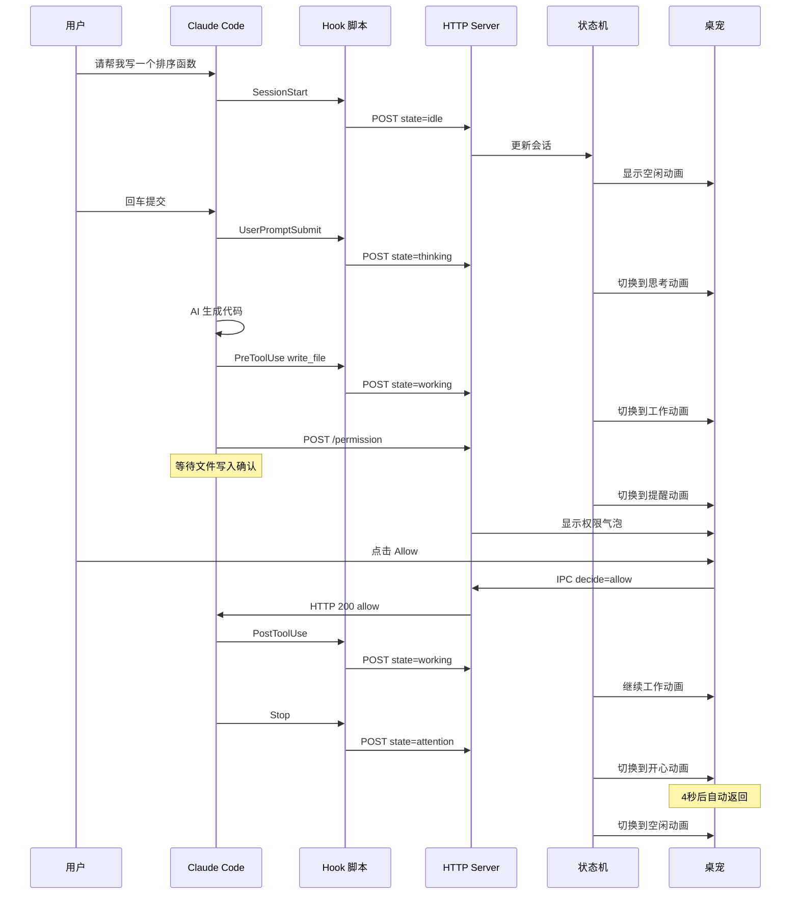

### 7.2 Comate 后台执行任务

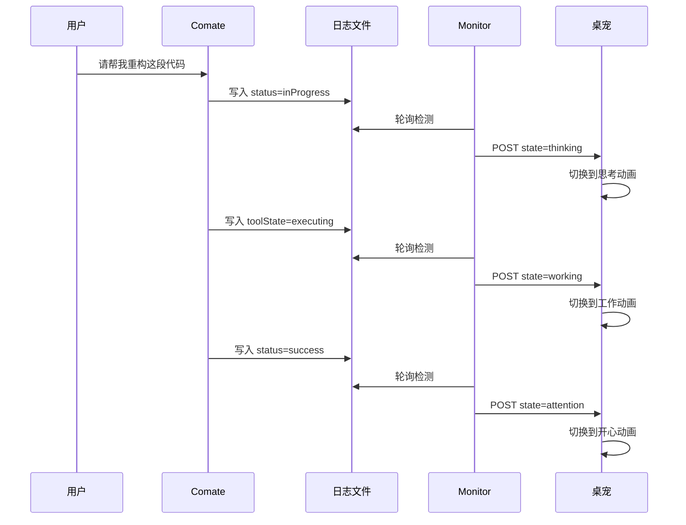

---

## 八、技术亮点

### 8.1 Hook 自动恢复

Claude Code 升级可能清除 Hook 配置，CodePing 会自动检测并恢复：

```javascript
// 监控 settings.json 文件变化
fs.watch(settingsDir, (event, filename) => {
  const content = fs.readFileSync(settingsPath, "utf-8");
  if (!content.includes("clawd-hook")) {
    console.log("Hook 被清除，自动重新注册");
    registerHooks();
  }
});
```

### 8.2 端口自动发现

支持多实例运行，自动选择可用端口：

```javascript
const PORTS = [23333, 23334, 23335, 23336, 23337];

async function findAvailablePort() {
  for (const port of PORTS) {
    if (await isPortAvailable(port)) return port;
  }
  throw new Error("No available port");
}
```

### 8.3 主题系统

支持自定义桌宠主题，通过 `theme.json` 配置：

```json
{
  "name": "Lucy Stone",
  "states": {
    "idle": { "file": "lucy-idle-follow.svg" },
    "thinking": { "file": "lucy-working-typing.svg" },
    "working": { "file": "lucy-working-typing.svg" }
  },
  "eyeTracking": {
    "enabled": true,
    "maxOffset": 2
  }
}
```

---

## 九、总结

CodePing 通过三层架构实现了 AI Agent 与桌宠的联动：

1. **适配层**：Command Hook / HTTP Hook / Log Monitor 三种方式适配不同 Agent
2. **核心层**：统一的 HTTP 服务器 + 状态机，处理多会话、优先级、防闪烁
3. **展示层**：双窗口透明桌宠 + 权限气泡，提供直观的状态反馈

这种设计既保证了对不同 Agent 的兼容性，又提供了统一的用户体验。
